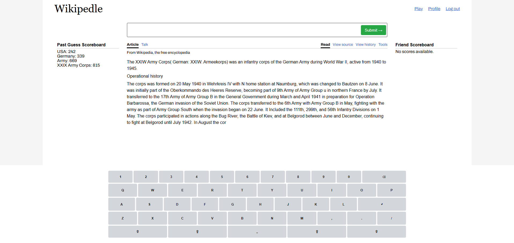
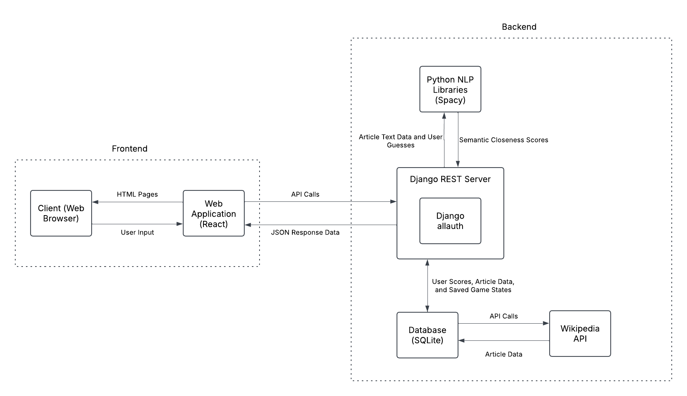

# team-70-project: Wikipedle



## What is Wikipedle?

Wikipedle is a wordle-esque game where you try and guess the title of a random, scrambled Wikipedia article.
The main aim is for fun and some educational value.
Users have 8 guesses to try and guess the title of the article.
After each guess, the game will score the guess based on how semantically similar the guess is to the Wikipedia article title and 
then unscrambled words as well based on how close those words are to the guess.
The application will track the user's statistics such as wins, average score, streak, and more.

## How to play

In order to play the game, the user must first login with a username and password (or create an account).
Once logged in, the web client will now display the scrambled Wikipedia article of the day, and the user can now begin guessing using the top input box.
Each day, the user can only play once.

## How to run

Wikipedle consists of a frontend web applicaiton and a backend server, which both need to be run simultaneously for the application to work.

### Running the backend server (django)
First, navigate to the backend folder in the terminal. 
Using the provided requirements.txt file, install the dependencies (optionally into a virtual environment).
```
cd backend
py -m pip install requirements.txt
```

Now, you can run the django server by navigating to the django_project folder and running manage.py.
Before running the server, make sure to populate the database with wikipedia articles with the following command:
```
cd django_project 
python manage.py fetch_wikipedia_articles --count <initial count>
```

This will fetch the articles and save them to the database.

Now, you can run the server by running the following command:
```
python manage.py runserver
```

### Running the frontend web application (react)
First, navigate to the frontend folder in the terminal. 
Using the provided package.json file, install the dependencies:
```
cd frontend
npm install
```

Now, you can run the frontend web application by running the following command:
```
npm start
```

Finally, since our project is still in the MVP stage, there is no hosting, so the server will only be run locally.
In a .env file located in the frontend folder, include the following line:
```
REACT_APP_BACKEND_URL=http://localhost:8000
```

## Team Members
Andrew Chen (amc19): Full-stack work with backend and frontend integration + Work with spaCy NLP

Prasanna Premkumar (pp41): Frontend work with React web applicaiton + User authentication

Xuanle Li (xuanlel2): Backend work with Django SQLlite database + Wikipedia API usage

## Technical Details



### Frontend
Provides a UI for displaying and interacting with the game

Built using the React library (Javascript)

Interacts with the django server through API calls:

* Requests game information to display
* Requests user information to display
* Sends user guesses to progress the game
* Sends user authentication requests

Contributors:
* Prasanna - implemented the on-screen, user authentication, profile page, and API calls associated with user authentication
* Andrew - created the main page for games and the API calls associated with game information

### Django REST Server
Provides the backend services in the form of API call responses

Built using the Django framework (Python)

Interacts with the functionalities of Django Allauth (authentication library), the NLP library, and the database in response to API calls from the frontend:
* Sends user authentication response using Django Allauth
* Sends game information response by accessing the database
* Sends user information response by accessing the database
* Processes user guesses using the NLP library and database

Contributors:
* Andrew - implemented the API paths associated with the game and user information responses and processing
* Prasanna - implemented the API paths associated with the user authentication processing with Django Allauth

### spaCy NLP Library
Provides the capability for the application to evaluate how close semantically the user’s guess was to the article title and text

Uses the spaCy NLP library (python)

Interacts with the main Django REST Server:
* Receives database data that is accessed by the main server
* Processes the user’s guess based on its semantic closeness to the article title and text
* Uses the results to inform the server of how the database should be updated

Contributors:
* Andrew - Implemented all functionalities related to using the spaCy library

### Database and Wikipedia API
Provides persistent storage for user authentication information, game statistics, and game state

Uses SQLite with Django ORM integration

Database and Wikipedia API Integration:
* User Authentication: Django-allauth handles authentication, stored via Django ORM models
* Game Statistics: Managed through Django models (UserProfile, DailyScore) and API views
* Session State: GameState model persists user progress, accessed via REST APIs
* Wikipedia Content: Fetched via service classes with wikipedia-api library cached in ArticleCache model
* Integration Methods: Management commands, middleware, app configuration, and API endpoints
* Test Coverage: Django TestCase for all models and utilities

Contributors:
* Xuanle: Implemented all functionalities relating to the database and using the Wikipedia API

